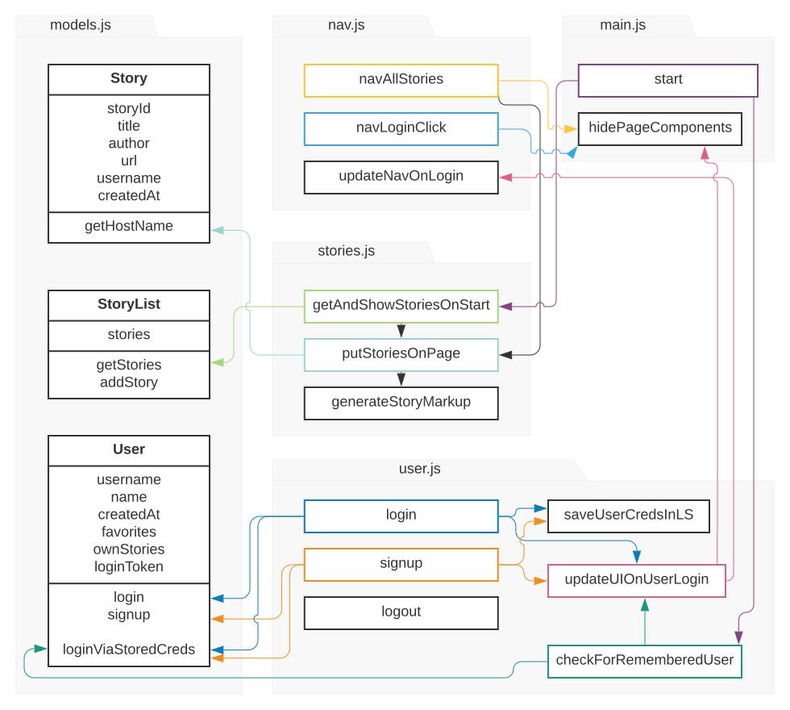

# Hack-or-Snooze

View Live at : __https://dlmedeiro.github.io/Hack-or-Snooze/__

functional clone of Hacker News based on the data available in their [API](https://hackorsnoozev3.docs.apiary.io/#). 

This site has the same stories someone can read on Hacker News. It allows users to create accounts and log in, save their favorite articles, and upload stories of their own.

Goal: Practice AJAX with jQuery

## Running Application Code:

Start code with ```python3 -m http.server```. 

Then view the site at __http://localhost:8000/__.

## Additional Notes

### Working solution
[Solution Example](http://hack-or-snooze.surge.sh/)

### The front-end app consists of two parts:

* Classes and methods for the big data ideas: a Story class for each story, a StoryList class for the list of stories, and a User class for the logged-in user (if any). These methods also handle interacting with the API.
* Functions for the UI, handling things like reading form values from forms and manipulating the DOM.

The code is divided up into these two parts for readability and maintenance. Creating a __separation of concerns and organization__ allowing for the data and the UI to be thought about separately

### Static Meaning and use cases
TBD

### Javascript Files

__js/models.js__
Contains classes to manage the data of the app and the connection to the API. The name models.js to describe a file containing these kinds of classes that focus on the data and logic about the data. UI stuff shouldn’t go here.

__js/main.js__
Contains code for starting the UI of the application, and other miscellaneous things.

__js/user.js__
Contains code for UI about logging in/signing up/logging out, as well as code about remembering a user when they refresh the page and logging them in automatically.

__js/stories.js__
Contains code for UI about listing stories.

__js/nav.js__
Contains code to show/hide things in the navigation bar, and well as code for when a user clicks in that bar.

### Diagram of initial functions and how they call the other functions
